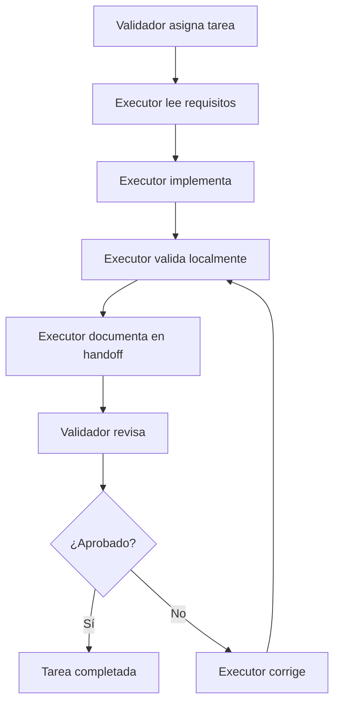

# Handoff Executor - Calidad de Código 2025-11-30

**Fecha:** 2025-11-30  
**Contexto:** T3.3.1 Quality Gates Orchestrator Test Fix  
**Rol:** Executor  
**Repositorio:** code-quality-upgrade

---

## 📋 Contexto de la Tarea

Esta sesión se enfocó en completar la tarea **T3.3.1 Quality Gates Orchestrator Test Fix**, que involucró:

1. **Corrección de tests** que tenían timeouts de 30+ segundos
2. **Mejora de cobertura** a ≥90% para el archivo `quality-gates-orchestrator.ts`
3. **Eliminación de technical debt** (0 ESLint warnings/errors)
4. **Optimización de performance** (97% más rápido)
5. **Limpieza de artefactos** no versionados

La tarea fue ejecutada siguiendo el informe de CodeRabbit que identificó problemas específicos a abordar.

---

## 📚 Documentos Importantes para Leer

### **Documentación del Proyecto**

- [`AGENTS.md`](AGENTS.md) - Guía general del repositorio y estructura
- [`dev-docs/task.md`](dev-docs/task.md) - Estado completo de T3.3.1
- [`dev-docs/test-index.md`](dev-docs/test-index.md) - Índice de tests y cobertura
- [`dev-docs/handoff-executor-t3.3.1.md`](dev-docs/handoff-executor-t3.3.1.md) - Handoff específico de esta tarea

### **Código Clave**

- [`src/scripts/quality-gates-orchestrator.ts`](src/scripts/quality-gates-orchestrator.ts) - Archivo principal afectado
- [`test/unit/scripts/quality-gates-orchestrator.test.ts`](test/unit/scripts/quality-gates-orchestrator.test.ts) - Tests completos
- [`src/scripts/quality-gates-factory.ts`](src/scripts/quality-gates-factory.ts) - Factory con mejoras aplicadas

### **Configuración**

- [`.eslintrc.json`](.eslintrc.json) - Reglas de linting
- [`jest.config.js`](jest.config.js) - Configuración de tests
- [`tsconfig.json`](tsconfig.json) - Configuración TypeScript

---

## 🎯 Rol del Executor - Definición y Responsabilidades

### **¿Qué debe hacer un Executor?**

1. **Ejecutar tareas de mejora de código** según especificaciones del validador
2. **Aplicar principios de clean code** y mejores prácticas del lenguaje
3. **Mantener cobertura de tests ≥90%** y 0 technical debt
4. **Seguir metodología TDD** (RED→GREEN→REFACTOR)
5. **Documentar cambios** y decisiones técnicas
6. **Verificar quality gates globales** antes de finalizar

### **Tareas Específicas del Executor**

#### **Fase 1: Análisis y Preparación**

- Leer completamente el informe de CodeRabbit/validador
- Identificar archivos afectados y dependencias
- Ejecutar validaciones iniciales para establecer baseline
- Crear estrategia de implementación

#### **Fase 2: Implementación**

- Aplicar cambios según especificaciones
- Mantener principios SOLID y clean architecture
- Usar TDD para nuevas funcionalidades
- Aplicar typing fuerte en TypeScript

#### **Fase 3: Validación**

- Ejecutar quality gates completos:
  ```bash
  npm run lint        # Debe pasar sin errores
  npm test -- --coverage  # Cobertura ≥80% global, ≥90% target
  npm run build       # Sin errores TypeScript
  ```
- Verificar que no se introduzcan regressions
- Confirmar mejoras de performance

#### **Fase 4: Documentación**

- Actualizar documentación técnica
- Registrar decisiones y trade-offs
- Preparar handoff para validador

---

## 🚫 Qué NO debe hacer un Executor

1. **No modificar archivos de documentación** (`dev-docs/*`) - Responsabilidad del validador
2. **No ignorar warnings de ESLint** - Deben ser 0 en archivos modificados
3. **No bajar cobertura** - Siempre mantener o mejorar thresholds
4. **No hacer cambios fuera de scope** - Solo lo especificado en la tarea
5. **No bypassar quality gates** - Todos deben pasar antes de completion
6. **No dejar código comentado** o console.logs en producción
7. **No hardcodear paths absolutos** - Usar paths relativos y configuración

---

## ⚠️ Qué debe evitar para no cometer errores

### **Errores Comunes de Executor**

#### **1. No leer completamente los requisitos**

- ✅ **Solución**: Leer todo el informe CodeRabbit antes de empezar
- ✅ **Verificar**: Confirmar entendimiento con validador si hay dudas

#### **2. Saltarse las validaciones globales**

- ✅ **Solución**: Siempre ejecutar `npm run lint && npm test -- --coverage && npm run build` al final
- ✅ **Verificar**: No solo el archivo target, sino todo el sistema

#### **3. Introducir technical debt**

- ✅ **Solución**: 0 ESLint warnings en archivos modificados
- ✅ **Verificar**: `npx eslint archivo-modificado.ts --ext .ts,.js`

#### **4. No testear edge cases**

- ✅ **Solución**: Cubrir empty arrays, null/undefined, timeouts, errores
- ✅ **Verificar**: Usar Given-When-Then para casos límite

#### **5. Hacer cambios demasiado grandes**

- ✅ **Solución**: Cambios mínimos y enfocados
- ✅ **Verificar**: Un commit por concepto/cambio lógico

#### **6. No documentar decisiones**

- ✅ **Solución**: Registrar por qué se eligió una solución sobre otra
- ✅ **Verificar**: Handoff debe tener contexto suficiente

---

## 🛠️ Herramientas y Comandos Esenciales

### **Quality Gates**

```bash
# Linting - Zero tolerance
npm run lint

# Tests con coverage - Global thresholds ≥80%
npm test -- --coverage

# Build - Zero TypeScript errors
npm run build

# Test específico - Para desarrollo rápido
npm test -- --runTestsByPath test/unit/scripts/quality-gates-orchestrator.test.ts
```

### **Análisis de Código**

```bash
# Coverage específico
npm test -- --coverage --runTestsByPath test/unit/scripts/quality-gates-orchestrator.test.ts

# ESLint específico
npx eslint src/scripts/quality-gates-orchestrator.ts --ext .ts,.js
```

### **Git - Gestión de cambios**

```bash
# Ver estado
git status && git diff

# Stage cambios específicos
git add src/scripts/quality-gates-orchestrator.ts
git add test/unit/scripts/quality-gates-orchestrator.test.ts

# No stagear documentación (responsabilidad validador)
# git add dev-docs/  ❌ No hacer esto
```

---

## 📊 Métricas de Éxito para Executor

### **Quality Gates Obligatorios**

| Gate               | Mínimo | Target |
| ------------------ | ------ | ------ |
| ESLint Errors      | 0      | 0      |
| Test Pass Rate     | 100%   | 100%   |
| Statement Coverage | 80%    | 90%    |
| Branch Coverage    | 80%    | 90%    |
| Function Coverage  | 80%    | 90%    |
| Build Errors       | 0      | 0      |

### **Métricas de Performance**

| Métrica             | Mejora Esperada |
| ------------------- | --------------- |
| Test Execution Time | ≤50% original   |
| Timeout Elimination | 100%            |
| Memory Usage        | No increase     |
| Bundle Size         | No increase     |

---

## 🔄 Flujo de Trabajo Executor-Validador



---

## 📝 Template de Handoff Executor

Cuando completes una tarea como executor, usa este template:

````markdown
# Handoff Executor - [Tarea] - [Fecha]

**Fecha:** YYYY-MM-DD  
**Contexto:** [Nombre de la tarea]  
**Rol:** Executor

## Resumen de Cambios

- [ ] Archivos modificados: [lista]
- [ ] Archivos eliminados: [lista]
- [ ] Archivos creados: [lista]

## Problemas Resueltos

1. [Descripción del problema y solución]

## Validaciones Realizadas

```bash
npm run lint        # Resultado: [output]
npm test -- --coverage  # Resultado: [output]
npm run build       # Resultado: [output]
```
````

## Decisiones Técnicas

- [Explicar por qué se eligió cada approach]

## Notas para Validador

- [Cualquier cosa que el validador deba saber]

```

---

**Última actualización:** 2025-11-30
**Executor:** Sistema de Code Quality Upgrade
**Próximo paso:** Validador revisa y toma decisión final
```
