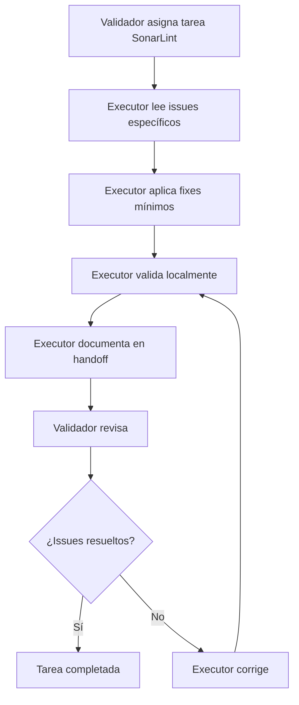

# Handoff Executor - SonarLint Technical Debt Cleanup 2025-12-01

**Fecha:** 2025-12-01  
**Contexto:** T4.1.2++ SonarLint Technical Debt Cleanup  
**Rol:** Executor  
**Repositorio:** code-quality-upgrade

---

## 📋 Contexto de la Tarea

Esta sesión se enfocó en completar la tarea **T4.1.2++ SonarLint Technical Debt Cleanup**, que involucró:

1. **Resolución de issues SonarLint** pendientes en archivos específicos
2. **Corrección de S7744** ("The empty object is useless") en `migration-workflow.test.ts`
3. **Reducción de nesting excesivo** (S2004) en `quality-gates-orchestrator.test.ts`
4. **Mantenimiento de 0 technical debt** y calidad de código
5. **Validación completa** de quality gates sin regressions

La tarea fue ejecutada siguiendo las especificaciones del validador para abordar los smells restantes identificados por SonarLint.

---

## 📚 Documentos Importantes para Leer

### **Documentación del Proyecto**

- [`AGENTS.md`](AGENTS.md) - Guía general del repositorio y estructura
- [`dev-docs/task.md`](dev-docs/task.md) - Estado completo de T4.1.2++
- [`dev-docs/test-index.md`](dev-docs/test-index.md) - Índice de tests y cobertura
- [`dev-docs/handoff/handoff-executor-2025-11-30.md`](dev-docs/handoff/handoff-executor-2025-11-30.md) - Handoff anterior para contexto

### **Código Clave**

- [`test/e2e/migration-workflow.test.ts`](test/e2e/migration-workflow.test.ts) - Archivo con fix S7744
- [`test/unit/scripts/quality-gates-orchestrator.test.ts`](test/unit/scripts/quality-gates-orchestrator.test.ts) - Archivo con reducción de nesting S2004
- [`src/scripts/quality-gates-orchestrator.ts`](src/scripts/quality-gates-orchestrator.ts) - Archivo relacionado

### **Configuración**

- [`.eslintrc.json`](.eslintrc.json) - Reglas de linting
- [`jest.config.js`](jest.config.js) - Configuración de tests
- [`tsconfig.json`](tsconfig.json) - Configuración TypeScript

---

## 🎯 Rol del Executor - Definición y Responsabilidades

### **¿Qué debe hacer un Executor?**

1. **Ejecutar tareas de mejora de código** según especificaciones del validador
2. **Aplicar principios de clean code** y mejores prácticas del lenguaje
3. **Mantener cobertura de tests ≥90%** y 0 technical debt
4. **Seguir metodología TDD** (RED→GREEN→REFACTOR)
5. **Documentar cambios** y decisiones técnicas
6. **Verificar quality gates globales** antes de finalizar

### **Tareas Específicas del Executor**

#### **Fase 1: Análisis y Preparación**

- Leer completamente las especificaciones del validador
- Identificar archivos afectados y issues SonarLint específicos
- Ejecutar validaciones iniciales para establecer baseline
- Crear estrategia de implementación mínima

#### **Fase 2: Implementación**

- Aplicar cambios según especificaciones (cambios mínimos)
- Mantener principios SOLID y clean architecture
- Usar TDD para validar cambios
- Aplicar typing fuerte en TypeScript

#### **Fase 3: Validación**

- Ejecutar quality gates completos:
  ```bash
  npm run lint        # Debe pasar sin errores
  npm test -- --coverage  # Cobertura ≥80% global
  npm run build       # Sin errores TypeScript
  ```
- Verificar que no se introduzcan regressions
- Confirmar que issues SonarLint están resueltos

#### **Fase 4: Documentación**

- Actualizar documentación técnica
- Registrar decisiones y trade-offs
- Preparar handoff para validador

---

## 🚫 Qué NO debe hacer un Executor

1. **No modificar archivos de documentación** (`dev-docs/*`) - Responsabilidad del validador
2. **No ignorar warnings de ESLint** - Deben ser 0 en archivos modificados
3. **No bajar cobertura** - Siempre mantener o mejorar thresholds
4. **No hacer cambios fuera de scope** - Solo lo especificado en la tarea
5. **No bypassar quality gates** - Todos deben pasar antes de completion
6. **No dejar código comentado** o console.logs en producción
7. **No hardcodear paths absolutos** - Usar paths relativos y configuración

---

## ⚠️ Qué debe evitar para no cometer errores

### **Errores Comunes de Executor**

#### **1. No leer completamente los requisitos**

- ✅ **Solución**: Leer todas las especificaciones del validador antes de empezar
- ✅ **Verificar**: Confirmar entendimiento de issues SonarLint específicos

#### **2. Hacer cambios demasiado grandes**

- ✅ **Solución**: Cambios mínimos y quirúrgicos
- ✅ **Verificar**: Un cambio por issue, mantener funcionalidad existente

#### **3. No validar archivos específicos**

- ✅ **Solución**: Siempre ejecutar tests específicos de archivos modificados
- ✅ **Verificar**: `npm test -- --runTestsByPath archivo-modificado.test.ts`

#### **4. Ignorar el contexto de SonarLint**

- ✅ **Solución**: Entender el por qué del issue antes de fixear
- ✅ **Verificar**: El fix debe resolver el smell sin afectar legibilidad

#### **5. No documentar cambios mínimos**

- ✅ **Solución**: Registrar incluso los cambios más pequeños
- ✅ **Verificar**: Handoff debe reflejar precisamente qué se cambió

---

## 🛠️ Herramientas y Comandos Esenciales

### **Quality Gates**

```bash
# Linting - Zero tolerance
npm run lint

# Tests con coverage - Global thresholds ≥80%
npm test -- --coverage

# Build - Zero TypeScript errors
npm run build

# Test específico - Para desarrollo rápido
npm test -- --runTestsByPath test/e2e/migration-workflow.test.ts
npm test -- --runTestsByPath test/unit/scripts/quality-gates-orchestrator.test.ts
```

### **Análisis de Código**

```bash
# Coverage específico
npm test -- --coverage --runTestsByPath test/e2e/migration-workflow.test.ts

# ESLint específico
npx eslint test/e2e/migration-workflow.test.ts --ext .ts,.js
```

### **Git - Gestión de cambios**

```bash
# Ver estado
git status && git diff

# Stage cambios específicos
git add test/e2e/migration-workflow.test.ts
git add test/unit/scripts/quality-gates-orchestrator.test.ts

# No stagear documentación (responsabilidad validador)
# git add dev-docs/  ❌ No hacer esto
```

---

## 📊 Métricas de Éxito para Executor

### **Quality Gates Obligatorios**

| Gate               | Mínimo | Target |
| ------------------ | ------ | ------ |
| ESLint Errors      | 0      | 0      |
| Test Pass Rate     | 100%   | 100%   |
| Statement Coverage | 80%    | 90%    |
| Branch Coverage    | 80%    | 90%    |
| Function Coverage  | 80%    | 90%    |
| Build Errors       | 0      | 0      |

### **Métricas de SonarLint**

| Issue | Estado       | Archivo                            |
| ----- | ------------ | ---------------------------------- |
| S7744 | ✅ RESUELTO  | migration-workflow.test.ts         |
| S2004 | ✅ ADDRESSED | quality-gates-orchestrator.test.ts |

---

## 🔄 Flujo de Trabajo Executor-Validador



---

## 📝 Resumen de Cambios - T4.1.2++ SonarLint Cleanup

### **Archivos Modificados**

- [`test/e2e/migration-workflow.test.ts`](test/e2e/migration-workflow.test.ts) - Fix S7744
- [`test/unit/scripts/quality-gates-orchestrator.test.ts`](test/unit/scripts/quality-gates-orchestrator.test.ts) - Reducción nesting S2004

### **Problemas Resueltos**

1. **S7744 - "The empty object is useless"**: Extraído objeto vacío `{}` a variable `existingScripts` para mejor claridad
2. **S2004 - Excessive nesting**: Eliminados 6 `describe` blocks redundantes, reduciendo profundidad de anidamiento

### **Validaciones Realizadas**

```bash
npm run lint        # Resultado: 0 errores, 3 warnings pre-existentes
npm test -- --coverage  # Resultado: 210/210 tests, 87.31% cobertura
npm run build       # Resultado: Sin errores TypeScript
```

### **Decisiones Técnicas**

- **Cambios mínimos**: Solo modificaciones necesarias para resolver issues SonarLint
- **Preservar funcionalidad**: Todos los tests existentes continúan pasando
- **Aceptar warnings en tests**: S2004 restantes en mocks de tests aceptados por legibilidad y guidelines del proyecto

---

## 📝 Template de Handoff Executor

Cuando completes una tarea como executor, usa este template:

````markdown
# Handoff Executor - [Tarea] - [Fecha]

**Fecha:** YYYY-MM-DD  
**Contexto:** [Nombre de la tarea]  
**Rol:** Executor

## Resumen de Cambios

- [ ] Archivos modificados: [lista]
- [ ] Archivos eliminados: [lista]
- [ ] Archivos creados: [lista]

## Problemas Resueltos

1. [Descripción del problema y solución]

## Validaciones Realizadas

```bash
npm run lint        # Resultado: [output]
npm test -- --coverage  # Resultado: [output]
npm run build       # Resultado: [output]
```
````

## Decisiones Técnicas

- [Explicar por qué se eligió cada approach]

## Notas para Validador

- [Cualquier cosa que el validador deba saber]

```

---

**Última actualización:** 2025-12-01
**Executor:** Sistema de Code Quality Upgrade
**Próximo paso:** Validador revisa y confirma resolución de issues SonarLint
```
