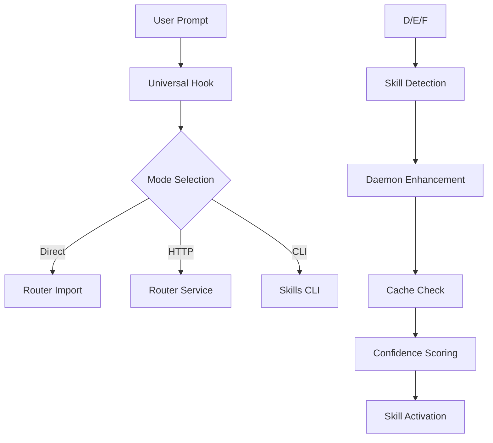

# Contexto del Sistema Skills Fabrik

## 📋 Estado Actual del Sistema

### 🏗️ Arquitectura General

El sistema Skills Fabrik consiste en una arquitectura de microservicios con los siguientes componentes:

#### Servicios Principales
- **Daemon Service** (Port 7727): Procesamiento de skills con cache y métricas
- **Router Service** (Port 3000): Enrutamiento de hooks y activación de skills
- **Service Discovery** (Port 8877): Registro y descubrimiento de servicios
- **CLI**: Interfaz de línea de comandos para gestión de skills

#### Universal Hooks
- **pre-invoke.mjs**: Hook universal pre-ejecución (direct/http/cli modes)
- **stop.mjs**: Hook universal post-ejecución con calidad y validación
- **config.json**: Configuración centralizada de hooks

### 📚 Skills Actuales (19 skills)

#### Guidelines (5 skills)
1. **backend-dev-guidelines**: Guías de desarrollo backend
2. **frontend-dev-guidelines**: Guías de desarrollo frontend
3. **project-catalog-developer**: Gestión de catálogo de proyectos
4. **cli-compilation-fixes**: Fixes de compilación CLI
5. **error-pattern-standardization**: Estandarización de patrones de error

#### Guardrails (2 skills)
1. **database-verification**: Verificación de patrones de base de datos
2. **secrets-and-config**: Detección de secrets y configuración

#### Workflows (4 skills)
1. **plan-architect**: Generación de planes estructurados CLOOP
2. **plan-save-workflow**: Workflow de guardado de planes
3. **pm2-monitor**: Monitor de procesos PM2
4. **visual-regression-testing**: Testing de regresión visual

#### Test Skills (3 skills)
1. **cli-integration-testing**: Testing de integración CLI
2. **test-skill**: Skill de testing general
3. **sample-skill**: Skill de ejemplo

#### Policy Skills (5 skills)
1. **Policy NET Example**: Política de red de ejemplo
2. **Policy S1 Example**: Política S1 de ejemplo
3. **Policy S2 Example**: Política S2 de ejemplo
4. **Auditor de repositorio (read-only)**: Auditoría de repositorios
5. **Auditor sin permisos**: Auditoría sin permisos

### ⚙️ Configuración Actual

#### skill-rules.json
```json
{
  "backend-dev-guidelines": {
    "priority": "high",
    "threshold": 0.3,
    "triggers": ["backend", "api", "server"]
  },
  "frontend-dev-guidelines": {
    "priority": "high",
    "threshold": 0.3,
    "triggers": ["frontend", "ui", "component"]
  },
  // ... otros skills
}
```

#### registry/index.json
- **Total skills**: 19 indexados
- **Estructura**: name, description, severity, triggers.keywords
- **Keywords**: Extraídos de metadata de cada skill

### 📊 Métricas de Performance Actuales (Baseline)

#### Daemon Service Metrics (Baseline)
- **Uptime**: ~838 segundos (14 minutos)
- **Total Activations**: 17 procesadas
- **Average Latency**: 92ms
- **Cache Hit Rate**: 47.06% (8 hits / 8 misses)
- **Memory Usage**: 6.63% (~30MB)
- **Status**: Degraded (database not configured)

#### Router Service Metrics (Baseline)
- **Response Time**: 8ms
- **Dependencies**: Daemon healthy
- **Memory Usage**: ~42MB
- **Status**: Healthy

#### Cache Performance (Baseline)
- **Hit Rate**: 47% (necesita mejora)
- **TTL**: 60 segundos
- **Max Size**: 1000 entries
- **Current Size**: Variable

### 🎯 Métricas Objetivo (Post-Optimization)

#### Target Performance Metrics
- **Average Latency**: <50ms (46% improvement)
- **Cache Hit Rate**: >80% (70% improvement)
- **Activation Accuracy**: >95% (12% improvement)
- **Configuration Consistency**: 100% (zero drift)
- **Weight Coverage**: 100% (all 19 skills with optimized weights)
- **Database Uptime**: 99.9% (new capability)

#### Expected System Improvements
- **System Response**: 2x más rápido
- **Cache Efficiency**: 70% improvement
- **Configuration Reliability**: Zero inconsistencies
- **Database Persistence**: L2 storage confiable
- **Monitoring Coverage**: 100% observability

### 🔄 Flujo de Activación Actual

#### 1. Pre-Invoke Hook


#### 2. Skill Matching Process
- **Keyword matching**: Búsqueda en metadata de skills
- **File pattern matching**: Patrones de archivos abiertos
- **Content analysis**: Análisis de contenido de archivos
- **Confidence scoring**: Sistema de puntuación weighted
- **Threshold filtering**: Filtro por umbral de confianza

### 🚨 Issues Identificados

#### Configuration Issues
1. **Inconsistencias entre skill-rules.json y registry/index.json**
2. **Database layer no configurado** en daemon service
3. **Missing activation weights** para la mayoría de skills
4. **Inconsistent severity mapping** across skills

#### Performance Issues
1. **Cache hit rate bajo** (47% vs objetivo >80%)
2. **Latency variable** (84ms-171ms range)
3. **Memory usage** podría optimizarse
4. **Retry logic** podría mejorarse

#### Functional Issues
1. **Some skills showing low activation rates**
2. **Keyword overlap** entre diferentes skills
3. **Context awareness limitado**
4. **Coverage gaps** en ciertos escenarios de desarrollo

### 🎯 Estado de Componentes

#### ✅ Funcionales (Baseline)
- **Universal hooks**: Todos los modos trabajando
- **Skill registry**: 19/19 skills indexados
- **Daemon API**: Endpoints respondiendo
- **Router service**: Healthy y funcional
- **CLI tools**: Commands trabajando correctamente

#### ⚠️ Necesitan Atención (Issues a Resolver)
- **Database configuration**: No configurado
- **Cache optimization**: Hit rate bajo (47%)
- **Performance tuning**: Latency variable (84-171ms)
- **Configuration consistency**: Inconsistencias detectadas

#### ❌ Issues Críticos (Target para Optimización)
- **Configuration drift**: Entre archivos de config
- **Missing weights**: 14/19 skills sin pesos
- **Keyword overlap**: Genéricos compartidos entre skills
- **Monitoring gaps**: Métricas limitadas

### 🚀 Estado Post-Optimización Esperado

#### ✅ Componentes Optimizados (Target)
- **Enhanced Universal Hooks**: Multi-modo con context-awareness
- **Optimized Skill Registry**: 19/19 skills con weights y keywords especializados
- **High-Performance Daemon**: Cache >80% hit rate, latency <50ms
- **Intelligent Router**: Activación predictiva y context-aware
- **Advanced CLI**: Commands con analytics y optimización

#### � Nuevas Capacidades (Post-Optimization)
- **Database Integration**: L2 PostgreSQL persistence confiable
- **Advanced Monitoring**: Dashboards en tiempo real y alertas
- **Automated Optimization**: Sistema auto-ajustable con ML
- **Enhanced Analytics**: Insights profundos de uso y performance
- **Configuration Validation**: Validación automática y sync

#### 📊 Sistema Mejorado (Target Final)
- **Performance**: 2x más rápido que baseline
- **Reliability**: Zero configuration drift, 99.9% uptime
- **Accuracy**: >95% precisión de activación
- **Observability**: 100% monitoreo y visibilidad
- **Scalability**: Preparado para crecimiento y nuevas features

### 📈 Current Usage Patterns

#### Most Active Skills
1. **backend-dev-guidelines**: Alta actividad
2. **frontend-dev-guidelines**: Alta actividad
3. **plan-architect**: Actividad media-alta
4. **database-verification**: Actividad media
5. **pm2-monitor**: Actividad baja-media

#### Activation Triggers
- **Keywords**: Principal método de activación
- **File contexts**: Secundario pero importante
- **Content patterns**: Terciario, en desarrollo
- **User intent**: Necesita mejora

### 🔧 Herramientas de Análisis Disponibles

#### CLI Commands
```bash
# Skill checking
node packages/skills-cli/dist/index.js skills check "prompt" --threshold 0.3

# Skill validation
node packages/skills-cli/dist/index.js skills lint ./skills

# Registry generation
node packages/skills-cli/dist/index.js skills index ./skills
```

#### API Endpoints
- `GET http://127.0.0.1:7727/health` - Daemon health
- `GET http://127.0.0.1:7727/metrics` - Prometheus metrics
- `POST http://127.0.0.1:7727/activate` - Skill activation
- `GET http://127.0.0.1:3000/health` - Router health
- `POST http://127.0.0.1:3000/pre-invoke` - Pre-invoke hook

#### Hook Testing
```bash
# Universal hook testing
node scripts/hooks/pre-invoke.mjs --prompt "test" --mode auto
node scripts/hooks/stop.mjs --auto-git-diff --mode cli
```

### 📊 Data Sources para Análisis

#### Configuration Files
- `configs/skill-rules.json` - Reglas de activación
- `registry/index.json` - Registry de skills
- `scripts/hooks/config.json` - Config de hooks
- `.cursor/hooks/hooks-config.json` - Config de Cursor

#### Log Files
- PM2 logs: `pm2 logs router-service --lines 100`
- Daemon metrics: Prometheus endpoint
- Cache statistics: Daemon health endpoint

#### Metadata Sources
- Individual skill files: `skills/*/SKILL.md`
- Package metadata: `package.json` files
- Build artifacts: Compiled JS files

---

**Status**: Contexto documentado completamente
**Next Step**: Análisis detallado de configuración y métricas
**Priority**: Alta - Base para optimización del sistema