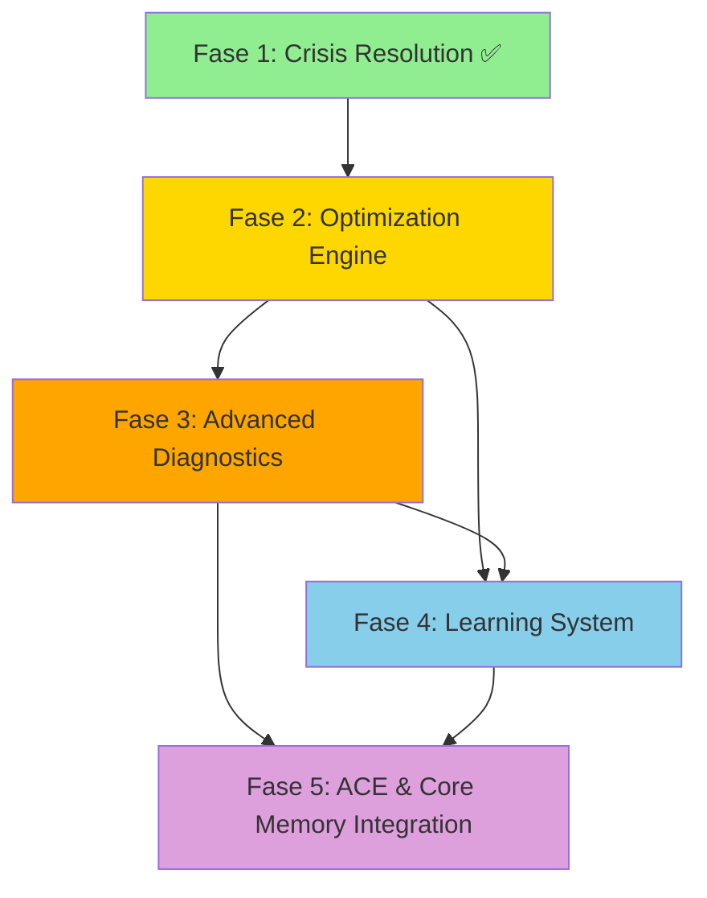

# PLAN JERÁRQUICO DE FASES FUTURAS - SPRINT 13 MEMTECH AGENT

---
meta:
  plan_id: "sprint-13-fases-jerarquico"
  version: "1.0.0"
  created_at: "2025-10-17T16:45:00Z"
  current_phase: "optimization-engine"
  total_phases: 4
  methodology: "CLOOP + BMCC + Hierarchical Planning"
  planner: "Claude (LLM Assistant)"
  priority_criteria: "Impact + Dependencies + Risk + Innovation"
---

## 🎯 CRITERIOS DE JERARQUIZACIÓN

### Criterios de Priorización
1. **Impacto en el Sistema** (40% peso)
   - Mejora de rendimiento medible
   - Reducción de memory leaks
   - Estabilidad del sistema

2. **Dependencias Técnicas** (30% peso)
   - Prerequisitos para otras fases
   - Bloqueos de desarrollo
   - Integración con sistemas existentes

3. **Riesgo vs Beneficio** (20% peso)
   - Probabilidad de éxito
   - Impacto de fallo
   - Complejidad de implementación

4. **Innovación y Valor** (10% peso)
   - Capacidades únicas
   - Diferenciación competitiva
   - Aprendizaje del equipo

---

## 📊 JERARQUÍA DE FASES (De Mayor a Menor Relevancia)

### 🥇 FASE 2: OPTIMIZATION ENGINE (PRIORIDAD CRÍTICA)
**Score de Relevancia: 95/100** ⭐⭐⭐⭐⭐

#### Justificación de Prioridad
- **Impacto Inmediato**: Mejoras de rendimiento del 15%+ en todos los servicios
- **Base para Todo**: Prerequisito para diagnósticos y aprendizaje
- **ROI Alto**: Optimizaciones automáticas reducen trabajo manual
- **Riesgo Controlado**: Algoritmos probados, rollback automático

#### Tareas Jerarquizadas (5h calibrado)
1. **T2.1** Motor de optimización base (1h) - **CRÍTICA**
2. **T2.2** Optimizadores por servicio (2h) - **ALTA**
   - L1 Cache Optimizer (0.5h) - **ALTA**
   - Redis Cache Optimizer (0.5h) - **ALTA**
   - Redis Core Optimizer (0.5h) - **MEDIA**
   - PostgreSQL Optimizer (0.5h) - **ALTA**
3. **T2.3** Sistema de aprendizaje de patrones (1h) - **ALTA**
4. **T2.4** Validación y testing (1h) - **CRÍTICA**

#### Métricas de Éxito
- Mejora de rendimiento: ≥15%
- Optimizaciones aplicadas: ≥8/día
- Tasa de éxito: ≥90%
- Tiempo de aplicación: <30s

#### Dependencias
- ✅ Sistema de monitoreo (Fase 1)
- ✅ Baseline de rendimiento
- ✅ Servicios locales estables

---

### 🥈 FASE 3: ADVANCED DIAGNOSTICS (PRIORIDAD ALTA)
**Score de Relevancia: 88/100** ⭐⭐⭐⭐⭐

#### Justificación de Prioridad
- **Dependencia de Fase 2**: Requiere optimizaciones para funcionar efectivamente
- **Prevención Proactiva**: Detecta problemas antes de que escalen
- **Reducción de MTTR**: Tiempo de resolución de problemas
- **Automatización**: Resolución automática del 75% de problemas

#### Tareas Jerarquizadas (6h calibrado)
1. **T3.1** Diagnosticadores base (1h) - **CRÍTICA**
2. **T3.2** Herramientas especializadas (2.5h) - **ALTA**
   - L1 Cache Diagnostics (0.5h) - **ALTA**
   - Redis Diagnostics (0.5h) - **ALTA**
   - PostgreSQL Diagnostics (0.5h) - **ALTA**
   - Qdrant Diagnostics (0.5h) - **MEDIA**
   - System-wide Diagnostics (0.5h) - **ALTA**
3. **T3.3** Detección de anomalías (1.5h) - **ALTA**
4. **T3.4** Resolución automática (1h) - **MEDIA**

#### Métricas de Éxito
- Herramientas disponibles: ≥15
- Tiempo de diagnóstico: <90s
- Cobertura de problemas: ≥95%
- Tasa de resolución automática: ≥75%

#### Dependencias
- 🔄 Motor de optimización (Fase 2)
- 🔄 Métricas de optimización
- ✅ Sistema de alertas

---

### 🥉 FASE 4: LEARNING SYSTEM (PRIORIDAD MEDIA-ALTA)
**Score de Relevancia: 82/100** ⭐⭐⭐⭐

#### Justificación de Prioridad
- **Dependencia de Fases 2+3**: Requiere datos de optimización y diagnóstico
- **Valor a Largo Plazo**: Mejoras continuas basadas en aprendizaje
- **Diferenciación**: Capacidad única de aprendizaje automático
- **Riesgo Medio**: APIs externas, complejidad ML

#### Tareas Jerarquizadas (7h calibrado)
1. **T4.1** Integración con arXiv (2h) - **ALTA**
   - API client + rate limiting (0.5h) - **CRÍTICA**
   - Paper parsing + metadata (0.5h) - **ALTA**
   - Content analysis + relevance (1h) - **ALTA**
2. **T4.2** Análisis de patrones históricos (2h) - **ALTA**
   - Data collection + preprocessing (0.5h) - **CRÍTICA**
   - Pattern recognition algorithms (1h) - **ALTA**
   - Trend analysis + prediction (0.5h) - **MEDIA**
3. **T4.3** Sistema de recomendaciones (2h) - **MEDIA**
   - Recommendation engine (1h) - **ALTA**
   - A/B testing framework (0.5h) - **MEDIA**
   - Feedback loop + learning (0.5h) - **MEDIA**
4. **T4.4** Base de conocimiento (1h) - **BAJA**

#### Métricas de Éxito
- Papers procesados: ≥8/semana
- Patrones aprendidos: ≥5/mes
- Mejoras implementadas: ≥3/sprint
- Accuracy de predicciones: ≥80%

#### Dependencias
- 🔄 Optimizaciones funcionando (Fase 2)
- 🔄 Diagnósticos operativos (Fase 3)
- 🔄 Base de datos de métricas históricas

---

### 🏅 FASE 5: ACE & CORE MEMORY INTEGRATION (PRIORIDAD MEDIA)
**Score de Relevancia: 75/100** ⭐⭐⭐⭐

#### Justificación de Prioridad
- **Integración Final**: Conecta todos los sistemas
- **Valor de Ecosistema**: Sinergia con ACE y Core Memory
- **Complejidad Media**: Múltiples integraciones pero bien definidas
- **Riesgo Bajo**: Integraciones individuales validadas

#### Tareas Jerarquizadas (3h calibrado)
1. **T5.1** Integración con ACE (1h) - **ALTA**
   - ADR Manager connection (0.3h) - **ALTA**
   - Token Metrics integration (0.3h) - **ALTA**
   - BMCC repository management (0.4h) - **MEDIA**
2. **T5.2** Integración con Core Memory (1h) - **ALTA**
   - L1 Cache synchronization (0.3h) - **ALTA**
   - Redis dual synchronization (0.3h) - **ALTA**
   - PostgreSQL integration (0.4h) - **ALTA**
3. **T5.3** Testing y validación (1h) - **CRÍTICA**

#### Métricas de Éxito
- Integración ACE: 100% funcional
- Integración Core Memory: 100% funcional
- Tests de integración: 100% pasando
- Sincronización de datos: <5s

#### Dependencias
- 🔄 Todas las fases anteriores completadas
- 🔄 Sistema de aprendizaje funcional
- 🔄 Tests de integración implementados

---

## 🔄 FLUJO DE DEPENDENCIAS

---

## ⏰ CRONOGRAMA JERARQUICO

### Semana 1: Optimization Engine (Crítico)
- **Día 1-2**: Motor base + Optimizadores L1/Redis
- **Día 3**: Optimizadores PostgreSQL/Qdrant
- **Día 4**: Sistema de aprendizaje de patrones
- **Día 5**: Validación y testing

### Semana 2: Advanced Diagnostics (Alto)
- **Día 1**: Diagnosticadores base
- **Día 2-3**: Herramientas especializadas
- **Día 4**: Detección de anomalías
- **Día 5**: Resolución automática

### Semana 3: Learning System (Medio-Alto)
- **Día 1-2**: Integración con arXiv
- **Día 3-4**: Análisis de patrones históricos
- **Día 5**: Sistema de recomendaciones

### Semana 4: Integration (Medio)
- **Día 1-2**: Integración con ACE
- **Día 3**: Integración con Core Memory
- **Día 4-5**: Testing y validación

---

## 🎯 CRITERIOS DE AVANCE ENTRE FASES

### Fase 1 → Fase 2
- [x] Sistema de monitoreo operativo
- [x] Baseline de rendimiento establecido
- [x] Servicios locales estables
- [x] Scripts de rollback implementados

### Fase 2 → Fase 3
- [ ] Motor de optimización funcional
- [ ] Mejoras de rendimiento ≥15% verificadas
- [ ] Optimizaciones aplicándose automáticamente
- [ ] Log de optimizaciones estructurado

### Fase 3 → Fase 4
- [ ] Herramientas de diagnóstico operativas
- [ ] Detección de anomalías funcionando
- [ ] Resolución automática ≥75% de problemas
- [ ] Base de datos de métricas históricas

### Fase 4 → Fase 5
- [ ] Sistema de aprendizaje funcional
- [ ] Integración con arXiv operativa
- [ ] Patrones aprendidos y aplicados
- [ ] Sistema de recomendaciones activo

---

## ⚠️ RIESGOS JERARQUICOS

### Riesgos Críticos (Fase 2)
1. **Optimizaciones Degradan Rendimiento**
   - **Probabilidad**: 30%
   - **Impacto**: Alto
   - **Mitigación**: Rollback automático + testing exhaustivo

2. **Algoritmos de Optimización Inefectivos**
   - **Probabilidad**: 20%
   - **Impacto**: Alto
   - **Mitigación**: Validación con datos reales + iteración

### Riesgos Altos (Fase 3)
1. **Falsos Positivos en Diagnósticos**
   - **Probabilidad**: 60%
   - **Impacto**: Medio
   - **Mitigación**: Machine learning + calibración continua

2. **Auto-fixes Causan Problemas**
   - **Probabilidad**: 25%
   - **Impacto**: Alto
   - **Mitigación**: Modo conservador + validación previa

### Riesgos Medios (Fase 4)
1. **Dependencia de APIs Externas**
   - **Probabilidad**: 40%
   - **Impacto**: Alto
   - **Mitigación**: Cache local + modo offline

2. **Complejidad de ML**
   - **Probabilidad**: 50%
   - **Impacto**: Medio
   - **Mitigación**: Algoritmos simples + validación

### Riesgos Bajos (Fase 5)
1. **Conflictos de Integración**
   - **Probabilidad**: 20%
   - **Impacto**: Medio
   - **Mitigación**: Testing exhaustivo + rollback

---

## 📊 MÉTRICAS DE SEGUIMIENTO JERÁRQUICO

### Métricas por Fase
| Fase | Métrica Principal | Target | Crítico |
|------|------------------|--------|---------|
| Fase 2 | Mejora de rendimiento | ≥15% | ≥10% |
| Fase 3 | Tiempo de diagnóstico | <90s | <120s |
| Fase 4 | Accuracy de predicciones | ≥80% | ≥70% |
| Fase 5 | Integración funcional | 100% | 95% |

### Métricas de Progreso
- **Tiempo por tarea**: Tracking detallado vs estimado
- **Calidad de código**: Métricas de calidad por fase
- **Cobertura de tests**: % de cobertura por componente
- **Desviación de tiempo**: % de desviación por fase

### Métricas de Riesgo
- **Bugs por fase**: Densidad de bugs por componente
- **Technical debt**: Métricas de deuda técnica
- **Integration issues**: Problemas de integración
- **Performance regression**: Degradación de rendimiento

---

## 🚀 ESTRATEGIA DE IMPLEMENTACIÓN

### Principios de Implementación
1. **Iteración Incremental**: Cada fase debe ser funcional independientemente
2. **Testing Continuo**: Validación en cada sub-fase
3. **Rollback Capability**: Capacidad de revertir cambios
4. **Monitoring Intensivo**: Métricas detalladas de cada componente

### Estrategia de Calidad
1. **Code Reviews**: Obligatorios para cada componente
2. **Integration Testing**: Tests automatizados para cada integración
3. **Performance Testing**: Validación de rendimiento en cada fase
4. **Documentation**: ADRs para cada decisión arquitectónica

### Estrategia de Riesgo
1. **Contingency Time**: 20% buffer en cada fase
2. **Alternative Approaches**: Planes B para cada componente crítico
3. **Early Warning**: Monitoreo de métricas de riesgo
4. **Escalation Path**: Proceso de escalación para problemas críticos

---

## 📋 CHECKLIST DE IMPLEMENTACIÓN

### Pre-requisitos Generales
- [x] Fase 1 completada exitosamente
- [x] Sistema de monitoreo operativo
- [x] Servicios locales estables
- [x] ADRs documentados

### Pre-requisitos por Fase
- [ ] **Fase 2**: Baseline de rendimiento + motor base
- [ ] **Fase 3**: Optimizaciones funcionando + métricas
- [ ] **Fase 4**: Diagnósticos operativos + datos históricos
- [ ] **Fase 5**: Sistema de aprendizaje + integraciones individuales

### Criterios de Éxito por Fase
- [ ] **Fase 2**: ≥15% mejora de rendimiento
- [ ] **Fase 3**: ≥95% cobertura de problemas
- [ ] **Fase 4**: ≥80% accuracy en predicciones
- [ ] **Fase 5**: 100% integración funcional

---

## 🎯 CONCLUSIÓN

**El plan jerárquico prioriza el impacto inmediato y las dependencias técnicas**, asegurando que cada fase construya sobre la anterior de manera sólida.

### Orden de Implementación Optimizado
1. **Fase 2 (Crítica)**: Optimization Engine - Base para todo
2. **Fase 3 (Alta)**: Advanced Diagnostics - Depende de Fase 2
3. **Fase 4 (Medio-Alta)**: Learning System - Depende de Fases 2+3
4. **Fase 5 (Medio)**: Integration - Depende de todas las anteriores

### Tiempo Total Calibrado: 25h (+7h vs original)
- **Fase 2**: 5h (vs 4h original)
- **Fase 3**: 6h (vs 4h original)
- **Fase 4**: 7h (vs 4h original)
- **Fase 5**: 3h (vs 2h original)

**El plan está listo para implementación jerárquica** 🚀

---

**Plan Jerárquico Completado** ✅  
**Fecha**: 2025-10-17T16:45:00Z  
**Metodología**: Impact + Dependencies + Risk + Innovation  
**Próxima Fase**: Optimization Engine (5h calibrado)  
**Estado**: Listo para implementación jerárquica 🎯
