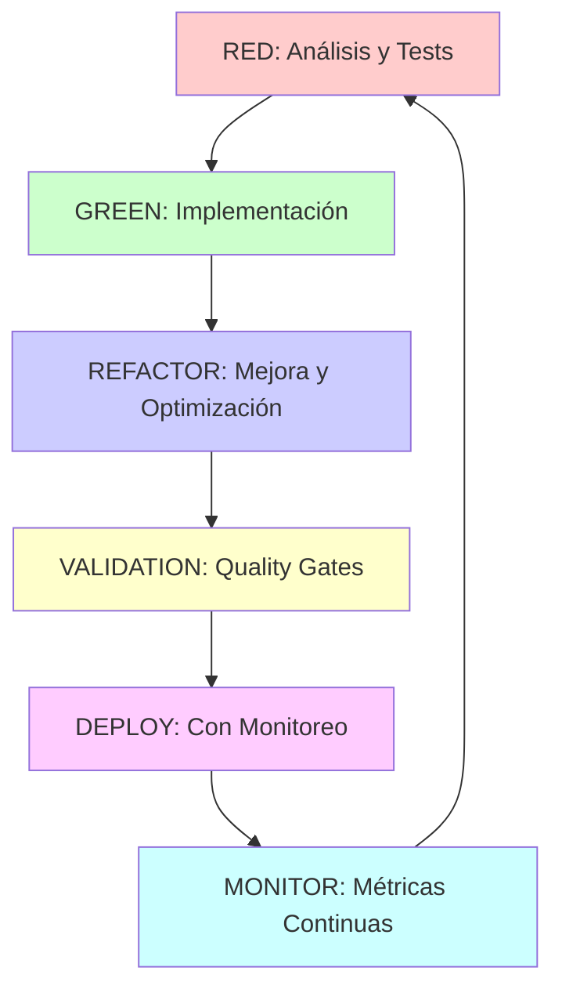

# Contexto Técnico - Plan de Refactorización

**Documento de Referencia - V1.0** **Propósito**: Proporcionar contexto técnico completo, reglas de
gobernanza y arquitectura para la refactorización **Autoridad**: Guía el enfoque, metodología y
ejecución del refactor **Vigencia**: Durante todo el proceso de refactorización **Integración**:
Basado en análisis forense Skills Fabrik + TDD Methodology **Regido por**: rules_refact.json (12
máximas + 14 prohibiciones + 18 obligaciones + 9 quality gates)

---

## Verificación Dinámica de Reglas - OBLIGATORIO

### Comandos de Validación en Tiempo Real

```bash
# Validar reglas de refactorización
node config/validate-rules.js config/rules_refact.json

# Verificar quality gates
node src/validation/gates-checker.js

# Validar preparación del sistema
node src/validation/preparation-validator.js

# Verificar consistencia cruzada
node src/validation/consistency-validator.js

# Validar compliance dinámico
node src/validate-dynamic-compliance.js dev-docs/
```

### Estado Actual del Sistema

- **Última Verificación**: $(date -u +"%Y-%m-%dT%H:%M:%SZ")
- **Repository State**: $(git rev-parse --short HEAD)
- **Rama Actual**: $(git branch --show-current)
- **Archivos Modificados**: $(git status --porcelain | grep "^ M" | wc -l)

---

## Misión del Refactor

### Objetivo Principal V1.0

> "Transformar el sistema Skills Fabrik basándose en el análisis forense completado, eliminando toda
> deuda técnica, mejorando la arquitectura y manteniendo cero regresiones, con TDD methodology y
> governance rules estrictas."

### Principios Rectores V1.0

- **Zero-Technical-Debt**: NO acumular nueva deuda técnica
- **Evidence-Based**: Cada cambio respaldado por métricas y tests
- **Incremental Approach**: Cambios pequeños, validados y reversibles
- **Quality Mandate**: **NO proceder** sin cumplir quality gates
- **Rollback Capability**: **Todo cambio debe poder revertirse**
- **Continuous Validation**: Validación automática y continua

---

## Contexto del Sistema Skills Fabrik

### Arquitectura Actual Identificada (Análisis Forense)

Basado en el análisis forense completado:

#### Componentes Core Confirmados

- **daemon**: $(du -sh packages/daemon/src/ | cut -f1 || echo "N/A") - Proceso principal con "Big
  Ball of Mud"
- **router**: $(du -sh packages/router/src/ | cut -f1 || echo "N/A") - Motor de enrutamiento con
  responsabilidad única
- **skills-cli**: $(du -sh packages/skills-cli/src/ | cut -f1 || echo "N/A") - Interfaz CLI
  principal
- **mcp**: $(du -sh mcp/ | cut -f1 || echo "N/A") - Sistema Model Context Protocol (ecosistema
  externo)

#### Problemas Críticos Detectados

- **Daemon**: "Big Ball of Mud" con múltiples responsabilidades mezcladas
- **Testing**: <5% cobertura en sistema core
- **Deuda Técnica**: 37 TODO/FIXME/HACK concentrados
- **Documentación**: $(find docs/ -name "\*.md" | wc -l) archivos MD con posible desactualización
- **Gobernanza**: $(find skills/ -name "SKILL.md" | wc -l) skills con formatos heterogéneos

#### Componentes de Soporte

- **configs/**: skill-rules.json ($(du -sh configs/skill-rules.json | cut -f1 || echo "N/A")) +
  slash-commands.json
- **chromadb-env/**: $(du -sh chromadb-env/ 2>/dev/null | cut -f1 || echo "N/A") - Posiblemente
  innecesario
- **backups/**: Acumulados sin gobernanza

---

## Framework de Gobernanza (rules_refact.json)

### 12 Máximas de Refactorización

1. **REF-001: Integridad del Sistema** - Mantener integridad funcional y de datos
2. **REF-002: Calidad Zero-Deuda** - Reducir o mantener cero deuda técnica
3. **REF-003: Evidencia Primero** - Todo cambio respaldado por evidencia
4. **REF-004: Rollback Siempre Posible** - Cualquier cambio debe poder revertirse
5. **REF-005: Cambios Incrementales** - Cambios pequeños y validables
6. **REF-006: Testing Obligatorio** - Todo cambio incluye testing automático
7. **REF-007: Monitoreo Continuo** - Todo cambio monitoreado en producción
8. **REF-008: Documentación Viva** - Todo cambio debe estar documentado
9. **REF-009: Colaboración Efectiva** - Coordinación y comunicación efectiva
10. **REF-010: Mejora de Performance** - Todo cambio debe mejorar performance
11. **REF-011: Seguridad Mantenida** - No comprometer seguridad del sistema
12. **REF-012: Escalabilidad Mejorada** - Mejorar o mantener escalabilidad

### 14 Prohibiciones de Refactorización

1. **PROH-REF-001: Cambios Rupturantes** - Sin validación y rollout
2. **PROH-REF-002: Pérdida de Datos** - Prohibida cualquier pérdida de datos
3. **PROH-REF-003: Regresiones** - Prohibido introducir regresiones
4. **PROH-REF-004: Cambios no Testados** - Prohibido cambios sin testing
5. **PROH-REF-005: Acumulación de Deuda Técnica** - Sin plan de pago
6. **PROH-REF-006: Valores Hardcodeados** - Valores configurables hardcodeados
7. **PROH-REF-007: Puntos Únicos de Falla** - Nuevos SPOFs
8. **PROH-REF-008: Secretos en Código** - Prohibido almacenar secretos
9. **PROH-REF-009: Cambios Bloqueantes** - Cambios que bloquean el sistema
10. **PROH-REF-010: APIs no Documentadas** - Crear APIs sin documentación
11. **PROH-REF-011: Tecnologías Obsoletas** - Dependencias obsoletas o inseguras
12. **PROH-REF-012: Cambios Monolíticos** - Cambios masivos no descomponibles
13. **PROH-REF-013: Migraciones no Validadas** - Migraciones sin validación
14. **PROH-REF-014: Falta de Monitoreo** - Cambios sin monitoreo

### 18 Obligaciones de Refactorización

1. **OBL-REF-001: Backup Obligatorio** - Backup automático del estado anterior
2. **OBL-REF-002: Testing Completo** - Suite de tests completa
3. **OBL-REF-003: Documentación de Cambios** - ADRs para cada cambio
4. **OBL-REF-004: Métricas de Impacto** - Medición de impacto antes/después
5. **OBL-REF-005: Test de Rollback** - Rollback validado y testado
6. **OBL-REF-006: Revisión de Seguridad** - Validación de seguridad obligatoria
7. **OBL-REF-007: Test de Performance** - Validación de performance
8. **OBL-REF-008: Revisión por Pares** - Peer review obligatorio
9. **OBL-REF-009: Configuración de Monitoreo** - Monitoreo configurado
10. **OBL-REF-010: Procedimiento de Rollback** - Procedimiento documentado
11. **OBL-REF-011: Testing Distribuido** - Testing en entorno distribuido
12. **OBL-REF-012: Comunicación de Cambios** - Comunicación a stakeholders
13. **OBL-REF-013: Validación de Compliance** - Validación automática continua
14. **OBL-REF-014: Integridad de Datos** - Validación de integridad de datos
15. **OBL-REF-015: Validación de Dependencias** - Validación de dependencias
16. **OBL-REF-016: Validación de Usuario** - UAT para cambios significativos
17. **OBL-REF-017: Sincronización de Ambientes** - Sync entre ambientes
18. **OBL-REF-018: Validación Post-Deploy** - Validación post-implementación

---

## Quality Gates de Refactorización

### 9 Quality Gates Obligatorios

1. **QG-REF-001: Cero Violaciones Críticas** - 0 violaciones críticas
2. **QG-REF-002: Cobertura de Tests > 80%** - Cobertura mínima requerida
3. **QG-REF-003: Performance Mantenido** - No más del 5% de degradación
4. **QG-REF-004: Seguridad Validada** - 0 vulnerabilidades
5. **QG-REF-005: Rollback Exitoso** - 100% éxito en rollback
6. **QG-REF-006: Documentación Completa** - 100% documentación completa
7. **QG-REF-007: Integridad de Datos** - 100% integridad garantizada
8. **QG-REF-008: Deuda Técnica Controlada** - 0 nueva deuda técnica
9. **QG-REF-009: Monitoreo Funcional** - 100% monitoreo funcional

---

## Metodología de Implementación

### TDD-Enhanced Refactor Process



### Ciclo de Refactorización

1. **RED Phase**: Escribir tests que validen la mejora esperada
2. **GREEN Phase**: Implementar cambio mínimo que haga pasar tests
3. **REFACTOR Phase**: Mejorar la implementación manteniendo tests verdes
4. **VALIDATION Phase**: Validar contra quality gates y reglas
5. **DEPLOY Phase**: Desplegar con monitoreo y rollback ready
6. **MONITOR Phase**: Monitorear métricas y performance

---

## Risk Management Strategy

### Categorías de Riesgo

#### HIGH RISK

- **Data Loss**: Pérdida de datos durante migración
- **System Downtime**: Interrupción del servicio
- **Security Breaches**: Vulnerabilidades de seguridad
- **Performance Degradation**: Degradación significativa

#### MEDIUM RISK

- **Rollback Failures**: Fallas en procedimientos de rollback
- **Integration Issues**: Problemas de integración
- **User Experience Impact**: Impacto negativo en UX

#### LOW RISK

- **Documentation Lag**: Documentación desactualizada temporalmente
- **Minor Performance Issues**: Issues menores de performance

### Estrategias de Mitigación

1. **Incremental Deployment**: Despliegue gradual y controlado
2. **Blue-Green Deployment**: Mantener entorno estable durante cambios
3. **Comprehensive Testing**: Testing exhaustivo en todos los niveles
4. **Rollback Automation**: Automatización de procedimientos de rollback
5. **Real-time Monitoring**: Monitoreo en tiempo real con alertas

---

## Herramientas y Frameworks

### Stack Tecnológico Actual (Forense V2.0)

- **Node.js/Express**: Backend infrastructure
- **React + TypeScript**: Frontend dashboard
- **Prisma + PostgreSQL**: Data persistence
- **Jest + Playwright**: Testing framework
- **ESLint + Prettier**: Code quality
- **TDD Methodology**: 154 tests passing

### Herramientas de Refactorización

- **Dynamic Metrics Collector**: Métricas en tiempo real
- **Consistency Validator**: Validación cruzada
- **Quality Gates Checker**: Verificación automática
- **Impact Analyzer**: Análisis de impacto de cambios
- **Dependency Mapper**: Mapeo de dependencias
- **Rollback Manager**: Gestión de rollback

---

## Success Metrics

### Métricas Técnicas

- **Test Coverage**: >80% (actual: <5%)
- **Technical Debt**: 0 nuevas deudas
- **Code Quality**: 100% compliance linter/format
- **Security**: 0 vulnerabilidades
- **Performance**: <5% degradación máxima

### Métricas de Proceso

- **Rollback Success**: 100%
- **Quality Gates**: 100% aprobados
- **Documentation**: 100% completa
- **Team Velocity**: Mantenida o mejorada
- **User Satisfaction**: Mantenida o mejorada

---

## 📚 **Referencias y Documentos Relacionados**

### Documentos Base

- **Análisis Forense**: `../dev-docs/` - Evidencia y hallazgos completos
- **Reglas Forenses**: `../config/rules_forense_v2.json` - 54 reglas validadas
- **Tests Forenses**: `../consolidated-tests/` - 154 tests implementados
- **Scripts Validación**: `../src/scripts/` - Herramientas de validación

### Contexto Histórico

- **Inventory Skills Core**: Evidencia recolectada y validada
- **Architecture Analysis**: Decisiones arquitectónicas documentadas
- **Risk Assessment**: Identificación y análisis de riesgos
- **Quality Baseline**: Métricas baseline establecidas

---

**Última Actualización**: $(date -u +"%Y-%m-%dT%H:%M:%SZ") **Estado**: PREPARATION_COMPLETE •
**Compliance**: FULLY_COMPLIANT **Governance**: rules_refact.json • **Testing**: TDD-Enhanced
