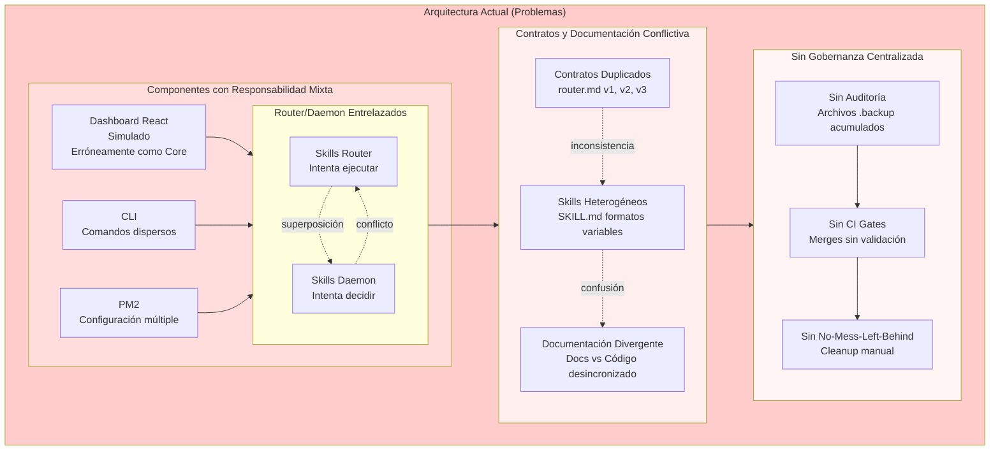

# Mermaid Diagrams - Skills Core Architecture

## Diagrama 1: Arquitectura Actual (Big Ball of Mud)



---

## Diagrama 2: Arquitectura Objetivo (Orquestador Central)

```mermaid
flowchart TD
    %% =========================================
    %% CAPA 1: CONTRATOS Y FUENTE DE VERDAD
    %% =========================================
    subgraph L1["Layer 1 – Contratos & Fuente de Verdad"]
        PB[Prompt Builder<br/>(plantillas y patrones)]
        DOCS[Dev Docs & Contratos<br/>dev-docs/contracts/*]
        SKILL_SPEC[Especificación SKILL.md<br/>(formato oficial)]

        PB --> DOCS
        PB --> SKILL_SPEC
        DOCS --> SKILL_SPEC
    end

    %% =========================================
    %% CAPA 2: ORQUESTACIÓN CENTRAL
    %% =========================================
    subgraph L2["Layer 2 – Núcleo Orquestador"]
        CLI[Skills CLI<br/>(comandos operativos)]
        PM2[pm2 Ecosystem<br/>configs/ecosystem.config.js]

        ROUTER[Skills Router<br/>(decisión de skill)]
        DAEMON[Skills Daemon<br/>(ejecutor de skills)]

        CLI --> PM2
        PM2 --> ROUTER
        PM2 --> DAEMON

        DOCS --> ROUTER
        DOCS --> DAEMON
    end

    %% =========================================
    %% CAPA 3: RUNTIME DE SKILLS
    %% =========================================
    subgraph L3["Layer 3 – Runtime & Skills"]
        PRE_HOOKS[Pre Hooks<br/>(validación, enrich, contexto)]
        REQ[Request / Evento de entrada]
        REQ --> PRE_HOOKS
        PRE_HOOKS --> ROUTER

        subgraph ROUTING["Decisión de Skill"]
            ROUTER --> CANDIDATES[Evaluación de candidatos<br/>(intents, reglas)]
            CANDIDATES --> SELECTED{{Skill elegido<br/>o null}}
        end

        SELECTED --> DAEMON

        subgraph SK_RUNTIME["Registro y Ejecución de Skills"]
            SK_REG[Registro de Skills<br/>skills/*/SKILL.md]
            SKILL_SPEC --> SK_REG

            DAEMON --> SK_REG
            SK_REG --> EXEC[Motor de ejecución de skill<br/>(tools, APIs, FS)]
            EXEC --> RESULT[Resultado estructurado]
        end
    end

    %% =========================================
    %% CAPA 4: OBSERVABILIDAD, NMLB Y AUDITORÍA
    %% =========================================
    subgraph L4["Layer 4 – Observabilidad & Gobernanza"]
        subgraph HOOKS["Hooks & No-Mess-Left-Behind"]
            STOP_HOOKS[Stop Hooks<br/>(post-ejecución)]
            NMLB[No-Mess-Left-Behind<br/>(cleanup, rollback, consistencia)]
        end

        subgraph OBS["Observabilidad"]
            LOGS[Logs & Métricas<br/>(eventos, KPIs)]
            DASH[Dashboard opcional<br/>(React, datos simulados o reales)]
        end

        subgraph AUDIT["Auditoría & CI"]
            AUD_PROC[Proceso de Auditoría<br/>(revisión de archivos y contratos)]
            REPORTS[Informes de auditoría<br/>(estado, basura, riesgos)]
            CI_GATE[CI Gate<br/>(bloquea merges si hay problemas graves)]
        end

        RESULT -.-> STOP_HOOKS
        SELECTED -.-> STOP_HOOKS
        STOP_HOOKS --> NMLB
        STOP_HOOKS --> LOGS
        NMLB --> LOGS

        LOGS --> DASH
        LOGS --> AUD_PROC
        AUD_PROC --> REPORTS
        REPORTS --> CI_GATE
    end

    %% =========================================
    %% RELACIONES TRANSVERSALES
    %% =========================================
    PB -.define contratos .-> DOCS
    DOCS -.guía auditoría .-> AUD_PROC

    PM2 -.monitoriza .-> ROUTER
    PM2 -.monitoriza .-> DAEMON
    CI_GATE -.protege main .-> PM2

    style L1 fill:#e1f5fe
    style L2 fill:#f3e5f5
    style L3 fill:#e8f5e8
    style L4 fill:#fff3e0
```

---

## Cómo Visualizar

1. **Ve a**: https://mermaid.live/
2. **Copia** el código del diagrama que quieras ver
3. **Pega** en el editor online
4. **Visualiza** instantáneamente
5. **Exporta** como PNG o SVG si lo necesitas

## Herramientas Alternativas

- **VS Code**: Extensión "Markdown Preview Mermaid Support"
- **Obsidian**: Soporte nativo para Mermaid
- **GitLab/GitHub**: Renderizado automático en archivos .md
