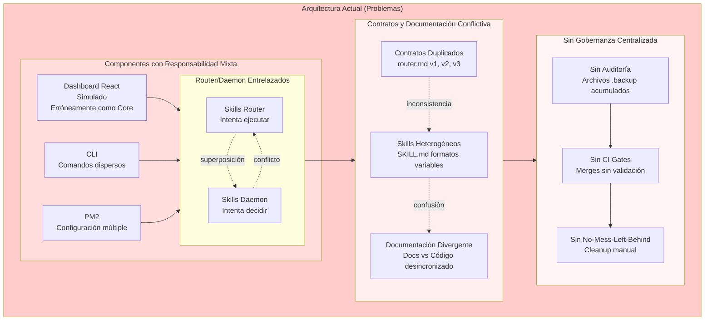

# Arquitectura Skills Core - Orquestador Central con Periferia de Skills

**Documento Oficial de Arquitectura - V1.0**
**Fecha**: 2025-11-13
**Estado**: Propuesta para Implementación

---

## Resumen Ejecutivo

Skills Core adopta oficialmente la arquitectura **"Orquestador Central con Periferia de Skills"**, una estructura de cuatro capas diseñada para proporcionar mantenibilidad, escalabilidad y claridad operativa a largo plazo. Esta arquitectura resuelve los problemas actuales de "Big Ball of Mud" y responsabilidad mixta estableciendo flujos unidireccionales claros, contratos definidos y gobernanza centralizada.

El sistema se compone de:

- **Capa 1**: Contratos y Fuente de Verdad
- **Capa 2**: Núcleo Orquestador
- **Capa 3**: Runtime de Skills
- **Capa 4**: Observabilidad y Gobernanza

Este documento establece el diseño objetivo, el diagnóstico del estado actual y el roadmap de implementación.

---

## Diagnóstico de Arquitectura Actual

### Estado Actual: "Big Ball of Mud" con Responsabilidad Mixta



### Problemas Identificados

1. **Dashboard React como Core**: El frontend está siendo tratado como parte del core cuando debe ser un cliente opcional
2. **Router/Daemon Superpuestos**: Ambos componentes intentan tomar decisiones y ejecutar acciones
3. **Contratos Duplicados**: Múltiples versiones del mismo contrato sin fuente de verdad única
4. **Skills Heterogéneos**: Formatos variables en SKILL.md sin estandarización
5. **Documentación Divergente**: Los documentos especifican un comportamiento pero el código implementa otro
6. **Ausencia de Gobernanza**: No hay proceso de auditoría, CI gates o cleanup automatizado

---

## Arquitectura Objetivo a 3-5 años

### "Orquestador Central con Periferia de Skills"

```mermaid
flowchart TD
    %% =========================================
    %% CAPA 1: CONTRATOS Y FUENTE DE VERDAD
    %% =========================================
    subgraph L1["Layer 1 – Contratos & Fuente de Verdad"]
        PB[Prompt Builder<br/>(plantillas y patrones)]
        DOCS[Dev Docs & Contratos<br/>dev-docs/contracts/*]
        SKILL_SPEC[Especificación SKILL.md<br/>(formato oficial)]

        PB --> DOCS
        PB --> SKILL_SPEC
        DOCS --> SKILL_SPEC
    end

    %% =========================================
    %% CAPA 2: ORQUESTACIÓN CENTRAL
    %% =========================================
    subgraph L2["Layer 2 – Núcleo Orquestador"]
        CLI[Skills CLI<br/>(comandos operativos)]
        PM2[pm2 Ecosystem<br/>configs/ecosystem.config.js]

        ROUTER[Skills Router<br/>(decisión de skill)]
        DAEMON[Skills Daemon<br/>(ejecutor de skills)]

        CLI --> PM2
        PM2 --> ROUTER
        PM2 --> DAEMON

        DOCS --> ROUTER
        DOCS --> DAEMON
    end

    %% =========================================
    %% CAPA 3: RUNTIME DE SKILLS
    %% =========================================
    subgraph L3["Layer 3 – Runtime & Skills"]
        PRE_HOOKS[Pre Hooks<br/>(validación, enrich, contexto)]
        REQ[Request / Evento de entrada]
        REQ --> PRE_HOOKS
        PRE_HOOKS --> ROUTER

        subgraph ROUTING["Decisión de Skill"]
            ROUTER --> CANDIDATES[Evaluación de candidatos<br/>(intents, reglas)]
            CANDIDATES --> SELECTED{{Skill elegido<br/>o null}}
        end

        SELECTED --> DAEMON

        subgraph SK_RUNTIME["Registro y Ejecución de Skills"]
            SK_REG[Registro de Skills<br/>skills/*/SKILL.md]
            SKILL_SPEC --> SK_REG

            DAEMON --> SK_REG
            SK_REG --> EXEC[Motor de ejecución de skill<br/>(tools, APIs, FS)]
            EXEC --> RESULT[Resultado estructurado]
        end
    end

    %% =========================================
    %% CAPA 4: OBSERVABILIDAD, NMLB Y AUDITORÍA
    %% =========================================
    subgraph L4["Layer 4 – Observabilidad & Gobernanza"]
        subgraph HOOKS["Hooks & No-Mess-Left-Behind"]
            STOP_HOOKS[Stop Hooks<br/>(post-ejecución)]
            NMLB[No-Mess-Left-Behind<br/>(cleanup, rollback, consistencia)]
        end

        subgraph OBS["Observabilidad"]
            LOGS[Logs & Métricas<br/>(eventos, KPIs)]
            DASH[Dashboard opcional<br/>(React, datos simulados o reales)]
        end

        subgraph AUDIT["Auditoría & CI"]
            AUD_PROC[Proceso de Auditoría<br/>(revisión de archivos y contratos)]
            REPORTS[Informes de auditoría<br/>(estado, basura, riesgos)]
            CI_GATE[CI Gate<br/>(bloquea merges si hay problemas graves)]
        end

        RESULT -.-> STOP_HOOKS
        SELECTED -.-> STOP_HOOKS
        STOP_HOOKS --> NMLB
        STOP_HOOKS --> LOGS
        NMLB --> LOGS

        LOGS --> DASH
        LOGS --> AUD_PROC
        AUD_PROC --> REPORTS
        REPORTS --> CI_GATE
    end

    %% =========================================
    %% RELACIONES TRANSVERSALES
    %% =========================================
    PB -.define contratos .-> DOCS
    DOCS -.guía auditoría .-> AUD_PROC

    PM2 -.monitoriza .-> ROUTER
    PM2 -.monitoriza .-> DAEMON
    CI_GATE -.protege main .-> PM2

    style L1 fill:#e1f5fe
    style L2 fill:#f3e5f5
    style L3 fill:#e8f5e8
    style L4 fill:#fff3e0
```

---

## Análisis Comparativo

| Característica     | Arquitectura Actual     | Arquitectura Objetivo            |
| ------------------ | ----------------------- | -------------------------------- |
| **Dashboard**      | Parte del core          | Cliente opcional (Layer 4)       |
| **Router**         | Superpuesto con daemon  | Solo decisión (Layer 2)          |
| **Daemon**         | Superpuesto con router  | Solo ejecución (Layer 2)         |
| **Contratos**      | Duplicados, divergentes | Single source of truth (Layer 1) |
| **Skills**         | Heterogéneos            | Estandarizados (Layer 3)         |
| **Flujo**          | Bidireccional, caótico  | Unidireccional, claro            |
| **Gobernanza**     | Ausente                 | Integrada (Layer 4)              |
| **Observabilidad** | Separada                | Centralizada                     |

---

## Fuera de Alcance

Skills Core se centra exclusivamente en la orquestación de skills y NO incluye:

- **Lógica de dominio de otros proyectos**: Skills Core no implementa lógica de negocio específica de proyectos externos
- **Dashboard React como componente core**: El Dashboard es un cliente opcional, no define contratos ni arquitectura core
- **Stack de almacenamiento**: No se cubre aquí el stack de almacenamiento (DBs, MemTech, etc.), solo orquestación de skills
- **Implementaciones específicas de herramientas**: Skills Core coordina herramientas pero no implementa su lógica interna

## Principios de Diseño

### 1. Separación de Responsabilidades

Cada capa tiene una responsabilidad única y bien definida. No hay superposición de funcionalidades.

### 2. Flujo Unidireccional

Los datos y decisiones fluyen en una dirección clara: Layer 1 → Layer 2 → Layer 3 → Layer 4.

### 3. Single Source of Truth

Cada contrato, configuración y especificación tiene exactamente una fuente oficial.

### 4. Gobernanza Integrada

La auditoría, limpieza y validación son parte intrínseca de la arquitectura, no un añadido.

### 5. Extensibilidad por Plugins

Los skills son componentes periféricos que se integran mediante contratos definidos.

## Mandamientos de Gobernanza

Estas reglas son obligatorias para todo desarrollo humano o automatizado:

1. **Unicidad de Contratos**: Nunca crear un segundo contrato de router/daemon/skills/NMLB sin decidir primero el destino del anterior
2. **Actualización Sincronizada**: Ningún cambio en contratos entra a main sin actualización simultánea de este documento o sus anexos
3. **Independencia del Core**: Skills Core no depende de dashboards ni frontends para funcionar
4. **Configuración Centralizada**: pm2 para Skills Core se configura solo en `configs/ecosystem.config.js`
5. **Autoridad de este Documento**: Si hay conflicto entre código y este diseño, el defecto está del lado del código, hasta que se actualicen los contratos

## Rutas Oficiales del Proyecto

En este documento, las rutas se interpretan así:

- **`dev-docs/`**: Documentación y contratos oficiales del sistema
- **`configs/`**: Archivos de configuración (pm2, etc.)
- **`skills/`**: Skills individuales y sus archivos SKILL.md
- **`packages/router`**: Código fuente del router
- **`packages/daemon`**: Código fuente del daemon
- **`packages/tools`**: Herramientas compartidas del sistema

---

## Single Source of Truth

### Rutas Oficiales

```
dev-docs/contracts/
├── router-contract.md      # Contrato oficial del router
├── daemon-contract.md      # Contrato oficial del daemon
├── skills-contract.md      # Contrato global de skills
└── no-mess-contract.md     # No-Mess-Left-Behind
```

```
configs/ecosystem.config.js  # Única configuración PM2
```

```
dev-docs/skill-contract.md   # Formato oficial SKILL.md
```

```
dev-docs/governance.md       # Reglas de gobernanza
```

### Criterios de Validez

1. **Ubicación**: Solo los archivos en rutas oficiales son válidos
2. **Vigencia**: Versiones antiguas deben marcarse como deprecated
3. **Consistencia**: Todo contrato debe estar alineado con la arquitectura
4. **Revisión**: Todo cambio requiere revisión mínima de dos personas

---

## Checklist de Acciones Inmediatas

### Fase 1: Estabilización (Semanas 1-2)

- [ ] **Nombrar oficialmente la arquitectura**:
  - Declarar: "Skills Core adopta la arquitectura Orquestador Central con Periferia de Skills"

- [ ] **Fijar rutas oficiales**:
  - Crear estructura `dev-docs/contracts/`
  - Consolidar configuración PM2 en `configs/ecosystem.config.js`
  - Estandarizar formato `dev-docs/skill-contract.md`

- [ ] **Guardar este documento**:
  - Archivar como referencia oficial
  - Compartir con equipo para alineación

### Fase 2: Limpieza (Semanas 3-4)

- [ ] **Auditoría de archivos existentes**:
  - Identificar archivos duplicados y obsoletos
  - Mover versiones antiguas a `archived/`
  - Eliminar archivos `.backup` innecesarios

- [ ] **Validación de contratos**:
  - Revisar contratos existentes vs especificaciones
  - Identificar inconsistencias
  - Actualizar para alinear con arquitectura

### Fase 3: Refactor (Semanas 5-8)

- [ ] **Separar responsabilidades**:
  - Router: solo lógica de decisión
  - Daemon: solo ejecución de procesos
  - Dashboard: mover a cliente opcional

- [ ] **Implementar flujo unidireccional**:
  - Validar que datos fluyan L1→L2→L3→L4
  - Eliminar dependencias circulares

- [ ] **Integrar gobernanza**:
  - Implementar hooks de NMLB
  - Crear proceso de auditoría automatizado
  - Establecer CI gates

### Fase 4: Validación (Semanas 9-12)

- [ ] **Testing de arquitectura**:
  - Validar separación de responsabilidades
  - Probar flujo unidireccional
  - Verificar gobernanza integrada

- [ ] **Documentación completa**:
  - Actualizar toda documentación técnica
  - Crear guías de desarrollo
  - Establecer proceso de onboarding

---

## Auditoría y Gobernanza

### Proceso de Auditoría Obligatorio

Toda auditoría de Skills Core debe evaluarse contra este documento. Si hay conflicto entre código y este diseño, el defecto está del lado del código, hasta que se actualicen los contratos.

La auditoría periódica debe revisar:

- **Integridad de Contratos**: Revisar archivos duplicados, versiones viejas y backups en contratos
- **Alineación Arquitectónica**: Validar que código respete las 4 capas y flujo unidireccional
- **Formato de Skills**: Verificar homogeneidad y cumplimiento del formato SKILL.md
- **Gobernanza Activa**: Confirmar funcionamiento de procesos de observabilidad y CI gates

Los resultados se documentan en informes legibles que listan conflictos, basura a eliminar, riesgos y recomendaciones.

### Autoridad Normativa

Este documento es la **fuente normativa** del proyecto, no una guía técnica. Cualquier cambio arquitectónico requiere primero la actualización de este documento y su aprobación según los mandamientos de gobernanza establecidos.

---

## Métricas de Éxito

### Arquitectura

- [ ] 100% de componentes con responsabilidad única
- [ ] 0 dependencias circulares
- [ ] 1 solo contrato por componente

### Calidad

- [ ] 100% de contratos alineados con arquitectura
- [ ] 0 archivos duplicados en código base
- [ ] CI gates activos y funcionando

### Mantenibilidad

- [ ] Nuevo desarrollador productivo en < 1 semana
- [ ] Cambios en skills sin afectar core
- [ ] Auditoría completada en < 30 minutos

---

**Estado**: Documento Oficial de Arquitectura V1.0 - Constitución del Proyecto
**Autoridad**: Máxima - Todos los cambios deben alinearse con este documento
