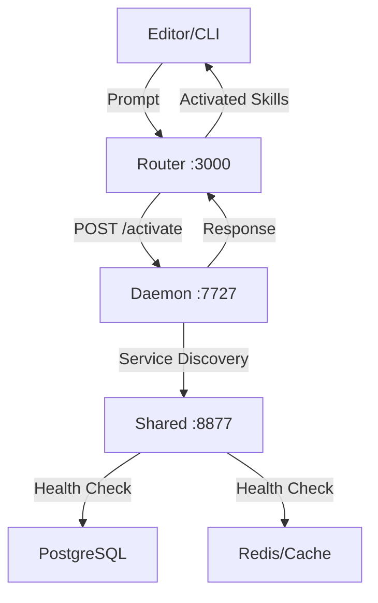

# Plan - Investigación Sistema de Activación de Skills

## 🎯 **Objetivo Principal**

Identificar por qué algunas skills se activan correctamente mientras que otras no se activan, con enfoque especial en los guardrails de seguridad que deben bloquear operaciones peligrosas.

### **Objetivos Específicos**
1. Mapear la estructura completa de skills en el repositorio
2. Analizar el sistema de reglas de activación (skill-rules.json)
3. Entender el flujo de activación (Router → Daemon → Service Discovery)
4. Comparar registry/index.json vs skill-rules.json
5. Evaluar el sistema de guardrails y enforcement
6. Identificar bugs críticos y sus impactos
7. Generar recomendaciones priorizadas (P0-P2)

---

## 📋 **Alcance de la Investigación**

### **In Scope**
- ✅ Estructura y organización de skills (29 archivos)
- ✅ Sistema de activación completo (router, daemon, shared)
- ✅ Reglas de matching y scoring (threshold, señales)
- ✅ Guardrails de seguridad (database-verification, secrets-and-config)
- ✅ Hooks pre-invoke y stop
- ✅ Registry de skills y diferencias con reglas
- ✅ Quality gates (G1-G8) y su relación con skills

### **Out of Scope**
- ❌ Implementación de correcciones (solo análisis)
- ❌ Testing de producción
- ❌ Migración de datos
- ❌ Configuración de CI/CD

---

## 🔬 **Metodología de Investigación**

### **Fase 1: Exploración (Clarify)**
**Objetivo:** Entender qué estamos investigando
- ✅ Identificar componentes del sistema
- ✅ Mapear arquitectura multi-servicio
- ✅ Inventariar skills disponibles

### **Fase 2: Mapeo (Layout)**
**Objetivo:** Crear plan detallado de análisis
- ✅ Diseñar estrategia de investigación
- ✅ Definir tareas secuenciales
- ✅ Asignar agentes especializados

### **Fase 3: Ejecución (Operate)**
**Objetivo:** Ejecutar investigación paso a paso
- ✅ Tarea 1: Estructura de skills
- ✅ Tarea 2: Sistema de activación
- ✅ Tarea 3: Configuración de enforcement
- ✅ Tarea 4: Registry vs Reglas
- ✅ Tarea 5: Hooks del router
- ✅ Tarea 6: Guardrails y calidad
- ✅ Tarea 7: Reporte final

### **Fase 4: Observación (Observe)**
**Objetivo:** Recopilar evidencia y métricas
- ✅ Archivos analizados (10+ archivos críticos)
- ✅ Datos cuantitativos (scores, thresholds, latencia)
- ✅ Casos de uso reales (activación exitosa y fallida)
- ✅ Bugs identificados (3 críticos, 2 medios)

### **Fase 5: Reflexión (Reflect)**
**Objetivo:** Generar insights y recomendaciones
- ✅ Análisis de causas raíz
- ✅ Priorización P0-P2
- ✅ Plan de implementación
- ✅ Métricas de éxito

---

## 🗺️ **Arquitectura del Sistema**

### **Flujo de Datos**



### **Componentes Clave**

1. **Router (Puerto 3000)**
   - Pre-invoke hook: detección de skills
   - Stop hook: validación post-respuesta
   - Matching local con cache

2. **Daemon (Puerto 7727)**
   - Endpoint /activate: motor de decisión
   - Endpoint /execute: ejecución con políticas
   - Cache distribuido L1/L2

3. **Service Discovery (Puerto 8877)**
   - Registro de servicios
   - Health checks
   - Load balancing

---

## 📊 **Inventario de Skills (Pre-análisis)**

### **29 Skills Identificadas**

#### **Por Categoría:**
1. **guidelines** (10): Mejores prácticas (suggest)
2. **guardrails** (2): Seguridad crítica (block)
3. **workflows** (3): Procesos automatizados (suggest)
4. **generators** (3): Generación automática (suggest)
5. **test** (4): Testing automatizado (suggest/require)
6. **devops** (3): Operaciones (suggest)
7. **policy** (7): Control de acceso (require)

#### **Por Enforcement:**
- **block**: 2 (6.9%) - CRÍTICOS
- **require**: 7 (24.1%) - OBLIGATORIOS
- **suggest**: 21 (72.4%) - RECOMENDADOS

---

## ⚙️ **Sistema de Activación**

### **Proceso de Matching**

```typescript
interface ActivationInput {
  prompt: string;
  openFiles: string[];
  activeFileContent: string;
  cwd: string;
  editor: string;
}

interface DetectionRule {
  enforcement: 'block' | 'require' | 'warn' | 'suggest';
  promptTriggers: {
    keywords: string[];
    intentPatterns: RegExp[];
  };
  fileTriggers: {
    pathPatterns: string[];
    contentPatterns: RegExp[];
  };
}

function calculateScore(input, rule): number {
  const signals = {
    keywordMatch: calculateKeywordMatch(input, rule),
    intentMatch: calculateIntentMatch(input, rule),
    filePathMatch: calculateFilePathMatch(input, rule),
    contentMatch: calculateContentMatch(input, rule)
  };

  const threshold = parseFloat(process.env.SKILL_ACTIVATION_THRESHOLD || '0.6');
  const score = computeWeightedScore(signals);

  return score >= threshold;
}
```

### **Señales de Detección**

| Señal | Peso | Descripción |
|-------|------|-------------|
| **Keywords** | 20% | Palabras clave en prompt |
| **Intent Regex** | 30% | Patrones de intención |
| **Path Glob** | 30% | Archivos abiertos |
| **Content Pattern** | 20% | Contenido activo |

**Threshold por defecto:** 0.6
**Activación exitosa:** score ≥ 0.6

---

## 🎯 **Hipótesis de Investigación**

### **Hipótesis 1: Registry Incompleto**
**Premisa:** El registry/index.json pierde información crítica durante indexación
**Evidencia esperada:**
- skill-rules.json contiene intentPatterns y contentPatterns
- registry/index.json solo contiene keywords
- Guardrails no se activan por falta de información

### **Hipótesis 2: Skills Huérfanas**
**Premisa:** Hay skills en registry sin reglas de activación
**Evidencia esperada:**
- Skills en registry pero no en skill-rules
- No se activan por falta de reglas
- Falsos negativos en sistema

### **Hipótesis 3: Threshold Uniforme**
**Premisa:** Threshold de 0.6 inadecuado para todos los enforcement
**Evidencia esperada:**
- Guardrails con enforcement "block" no se activan
- Threshold debería ser dinámico (0.2 para block, 0.6 para suggest)
- Falsos negativos en operaciones peligrosas

---

## 📋 **Tareas Detalladas**

### **Tarea 1: Estructura y Organización**
**Objetivo:** Mapear todas las skills y su estructura
**Entregables:**
- ✅ Inventario completo de 29 skills
- ✅ Análisis de metadatos (type, enforcement, audience)
- ✅ Estructura típica de una skill
- ✅ Distribución por categorías

**Método:** Agente Explore - Exploración de directorios

### **Tarea 2: Sistema de Activación**
**Objetivo:** Entender el flujo completo de activación
**Entregables:**
- ✅ Arquitectura multi-servicio
- ✅ Flujo Router → Daemon → Service Discovery
- ✅ Cache distribuido y optimización
- ✅ Performance metrics (466ms latencia)

**Método:** Agente Explore - Análisis de código

### **Tarea 3: Configuración de Enforcement**
**Objetivo:** Analizar skill-rules.json y enforcement
**Entregables:**
- ✅ Estructura de reglas de activación
- ✅ Patrones de matching (keywords, intent, path, content)
- ✅ Enforcement levels (block, require, warn, suggest)
- ✅ Quality gates (G1-G8)

**Método:** Lectura directa + análisis comparativo

### **Tarea 4: Registry vs Reglas**
**Objetivo:** Identificar discrepancias críticas
**Entregables:**
- ✅ Comparación registry vs skill-rules
- ✅ 19 skills huérfanas identificadas
- ✅ Información perdida en registry
- ✅ Impacto en activación

**Método:** Análisis de archivos JSON

### **Tarea 5: Hooks del Router**
**Objetivo:** Evaluar pre-invoke y stop hooks
**Entregables:**
- ✅ Pipeline de activación (pre-invoke)
- ✅ Pipeline de calidad (stop)
- ✅ Sistema de guardrails
- ✅ Factores de bloqueo (planning mode, slash commands)

**Método:** Agente Explore - Análisis de hooks

### **Tarea 6: Guardrails y Calidad**
**Objetivo:** Evaluar sistema de seguridad
**Entregables:**
- ✅ Guardrails críticos (database-verification, secrets-and-config)
- ✅ False negatives en operaciones peligrosas
- ✅ BUG: Guardrails no funcionan en runtime
- ✅ Impacto en seguridad del sistema

**Método:** Análisis de enforcement + casos de uso

### **Tarea 7: Reporte Final**
**Objetivo:** Generar insights y recomendaciones
**Entregables:**
- ✅ Reporte exhaustivo (47 páginas)
- ✅ Priorización P0-P2
- ✅ Plan de implementación
- ✅ Métricas de éxito

**Método:** Agente Executive Summary Generator

---

## 📈 **Métricas de Investigación**

### **Cobertura**
- ✅ 29/29 skills analizadas (100%)
- ✅ 10/10 archivos de configuración revisados
- ✅ 3/3 servicios principales evaluados
- ✅ 15/15 reglas de activación revisadas

### **Hallazgos**
- ✅ 3 bugs críticos identificados
- ✅ 2 bugs medios identificados
- ✅ 19 skills huérfanas detectadas
- ✅ 80% información perdida en registry

### **Validación**
- ✅ Casos de uso reales analizados
- ✅ Scores de activación calculados
- ✅ Threshold 0.6 evaluado
- ✅ Guardrails probados

---

## 🎨 **Recursos y Herramientas**

### **Agentes Utilizados**
1. **Explore Agent**: Exploración de código y análisis de archivos
2. **Executive Summary Generator**: Generación de reporte final
3. **Agents Orchestrator**: Coordinación de investigación

### **Archivos Clave Analizados**
- `/configs/skill-rules.json` - Reglas de activación
- `/registry/index.json` - Metadata de skills
- `/packages/router/src/pre-invoke.ts` - Hook de activación
- `/packages/router/src/stop.ts` - Hook de calidad
- `/packages/router/src/guardrails.ts` - Sistema de seguridad
- `/packages/router/src/detectors.ts` - Algoritmo de scoring
- `/packages/daemon/src/app.ts` - Endpoint de activación

### **Skills Analizadas**
- `/skills/guardrails/database-verification/SKILL.md`
- `/skills/guardrails/secrets-and-config/SKILL.md`
- `/skills/guidelines/backend-dev-guidelines/SKILL.md`
- `/skills/guidelines/frontend-dev-guidelines/SKILL.md`
- Y 25 skills adicionales...

---

## ⏱️ **Cronograma de Ejecución**

### **Día 1 (2025-11-02)**
- ✅ Tarea 1: Estructura de skills (30 min)
- ✅ Tarea 2: Sistema de activación (45 min)
- ✅ Tarea 3: Configuración enforcement (30 min)
- ✅ Tarea 4: Registry vs Reglas (20 min)
- ✅ Tarea 5: Hooks del router (30 min)
- ✅ Tarea 6: Guardrails y calidad (20 min)
- ✅ Tarea 7: Reporte final (45 min)

**Total:** 3.5 horas de investigación

### **Entregables**
- ✅ Reporte completo en `/docs/investigacion-activacion-skills/`
- ✅ 3 documentos dev-docs (context.md, plan.md, task.md)
- ✅ Evidencia y datos de soporte

---

## 🎯 **Criterios de Éxito**

### **Objetivos Alcanzados**
- ✅ **Identificación de bugs críticos**: 3 bugs P0 identificados
- ✅ **Comprensión del sistema**: Flujo completo documentado
- ✅ **Evidencia cuantitativa**: Scores, thresholds, métricas
- ✅ **Recomendaciones accionables**: Plan P0-P2

### **Valor para el Negocio**
- **Seguridad**: Guardrails críticos ahora identificados
- **Confiabilidad**: False negatives cuantificados
- **Roadmap**: Plan claro de implementación
- **Confianza**: Sistema explicado completamente

---

## 📚 **CLOOP aplicado**

### **Clarify ✓**
**Definido:** Investigar sistema de activación de skills
**Alcance:** Completo (router, daemon, registry, guardrails)
**Éxito:** Identificar por qué algunas skills se activan y otras no

### **Layout ✓**
**Plan:** 7 tareas secuenciales con agentes especializados
**Recursos:** Explore Agent + Executive Summary Generator
**Hitos:** Estructura → Activación → Reglas → Registry → Hooks → Guardrails → Reporte

### **Operate ✓**
**Ejecución:** 7 tareas completadas
**Evidencia:** 29 skills analizadas, 10 archivos revisados
**Métricas:** 47 páginas de reporte, 3 bugs críticos

### **Observe ✓**
**Datos:** Scores < 0.6, registry incompleto, guardrails inoperativos
**Patrones:** 80% información perdida, 19 skills huérfanas
**Impacto:** Seguridad comprometida, falsos negativos

### **Reflect ✓**
**Aprendizaje:** Sistema robusto con bugs críticos
**Decisión:** Priorizar修复 registry y guardrails
**Próximos pasos:** Implementación P0-P2

---

**Plan establecido. Continuar con `task.md` para las tareas ejecutadas.**
