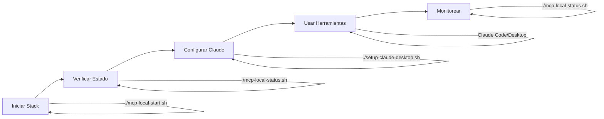

# 📁 MCP Local - Índice de Archivos

Esta carpeta contiene todos los archivos necesarios para ejecutar un servidor MCP local completo para Skills Fabric.

## 📋 Archivos Principales

### 🚀 Scripts de Gestión
- **`mcp-local-start.sh`** - Inicia todo el stack MCP (servicios Docker + Skills Fabric)
- **`mcp-local-stop.sh`** - Detiene todos los servicios
- **`mcp-local-status.sh`** - Muestra estado actual de todos los servicios
- **`mcp-local-test.sh`** - Suite completa de tests y validación

### 🛠️ Desarrollo
- **`mcp-dev.sh`** - Menú interactivo para desarrollo rápido
- **`mcp-test-tools.mjs`** - Script para probar herramientas MCP directamente
- **`setup-claude-desktop.sh`** - Configura integración con Claude Desktop

### 🐳 Docker & Servicios
- **`docker-compose.yml`** - Configuración de servicios Docker (Redis, PostgreSQL, ChromaDB)
- **`init.sql`** - Script de inicialización para PostgreSQL (tablas MemTech)

### 📖 Documentación
- **`claude-desktop-config.example.json`** - Configuración de ejemplo para Claude Desktop
- **`README_LOCAL_DEPLOYMENT.md`** - Documentación completa (en carpeta raíz)

## 🎯 Uso Rápido

### Inicio Rápido
```bash
# 1. Construir adapters
cd packages/mcp-adapters
pnpm build
cd ../../
cp .env.example .env

# 2. Iniciar stack
./mcp-local/mcp-local-start.sh

# 3. Verificar estado
./mcp-local/mcp-local-status.sh
```

### Desarrollo Interactivo
```bash
./mcp-local/mcp-dev.sh
```

### Probar Herramientas MCP
```bash
node ./mcp-local/mcp-test-tools.mjs --all
```

## 📊 Servicios Configurados

| Servicio | Puerto | Propósito | Estado |
|----------|--------|-----------|--------|
| Redis Cache (L0) | 6380 | Cache ultrarrápido | ✅ Requerido |
| Redis Core (L1) | 6381 | Memoria de trabajo | ✅ Requerido |
| PostgreSQL (L2) | 5433 | Contexto estructurado | ✅ Requerido |
| ChromaDB (L3) | 8000 | Búsqueda semántica | ⚠️ Opcional |
| MCP Server | STDIO/3001 | Servidor MCP | ✅ Requerido |
| Router | 3000 | Skills routing | ⚠️ Integrado |
| Daemon | 7727 | Servicios backend | ⚠️ Integrado |
| Discovery | 8877 | Service discovery | ⚠️ Integrado |

## 🔧 Herramientas MCP Disponibles

### Filesystem
- `fs_read_file` - Leer archivos
- `fs_write_file` - Escribir archivos
- `fs_list_directory` - Listar directorios
- `fs_file_exists` - Verificar existencia
- `fs_create_directory` - Crear directorios
- `fs_delete_file` - Eliminar archivos

### Git
- `git_status` - Estado del repositorio
- `git_diff` - Ver diferencias
- `git_commit` - Crear commits
- `git_log` - Historial de commits

### PM2
- `pm2_list` - Listar procesos
- `pm2_start` - Iniciar proceso
- `pm2_stop` - Detener proceso
- `pm2_restart` - Reiniciar proceso
- `pm2_logs` - Ver logs

### Metrics
- `metrics_emit_event` - Emitir eventos KPI
- `metrics_get_events` - Obtener eventos
- `metrics_get_summary` - Resumen de métricas

### Health
- `health_check` - Verificar conexiones
- `test_connections` - Probar todas las DB
- `validate_config` - Validar configuración

## 🚦 Flujo de Trabajo Típico



## 🆘 Comandos Útiles

```bash
# Ver estado detallado
./mcp-local/mcp-local-status.sh

# Verificar conectividad
./mcp-local/mcp-local-test.sh

# Ver logs Docker
cd mcp-local && docker-compose logs -f

# Limpiar todo y reiniciar
./mcp-local/mcp-local-stop.sh --cleanup
./mcp-local/mcp-local-start.sh
```

## 📚 Documentación Completa

Ver: **`../README_LOCAL_DEPLOYMENT.md`**

## 🔗 Enlaces

- [MCP Specification](https://modelcontextprotocol.io/)
- [Skills Fabric Docs](../docs/)
- [ADR Documentation](../docs/adr/)

---

**Nota**: Todos los scripts son ejecutables. Si no lo están, ejecuta:
```bash
chmod +x mcp-local/*.sh
```
