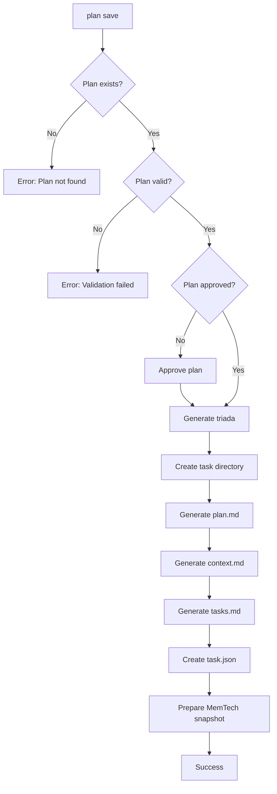

# Workflow Steps - Detalle

## Flujo Completo

## Verificaciones Post-Generación

Después de generar la tríada, verificar:

1. Todos los archivos existen
2. `plan.md` contiene toda la información del plan
3. `context.md` tiene estructura correcta
4. `tasks.md` tiene checklist derivado de fases
5. `task.json` referencia correctamente al plan

## Integración con Pre-invoke Hook

Una vez generada la tríada:
- Pre-invoke hook detecta `dev/active/<task>/task.json`
- Lee `planPath` y verifica que plan está APPROVED
- Permite ejecución si plan está aprobado
- Bloquea si no hay plan o plan no está aprobado

